  <h1>HST BANK</h1>
  
  

    <b>Bank simulation build with Spring Boot banking REST API and PostgreSQL.</b>
  

## Architecture

```mermaid
classDiagram

    %% ============ APPLICATION ENTRY ============
    class HstBankApiApplication {
        +main(String[] args)$ void
    }

    class AddTestValues {
        -UserService userService
        -AccountService accountService
        +run(String... args) void
    }

    %% ============ CONTROLLER LAYER ============
    class AuthController {
        -UserService userService
        +register(RegisterRequest) ResponseEntity~UserResponse~
        +login(LoginRequest) ResponseEntity~UserResponse~
    }

    class AccountController {
        -AccountService accountService
        -UserService userService
        +createAccount(CreateAccountRequest) ResponseEntity
    }

    class CardController {
        -CardService cardService
        -UserService userService
        +createCard(CardRequest) ResponseEntity
        +makePayment(Long, BigDecimal) ResponseEntity
    }

    class TransferController {
        -TransactionService transactionService
        -AccountService accountService
        +transfer(TransferRequest) ResponseEntity
        +externalTransfer(ExternalTransferRequest) ResponseEntity
        +getTransactionHistory(Long) ResponseEntity~List~TransactionResponse~~
        +getUserTransactions(Long) ResponseEntity~List~TransactionResponse~~
        +getTransactionsByType(Long, TransactionType) ResponseEntity~List~TransactionResponse~~
    }

    class ExchangeController {
        -ExchangeService exchangeService
        -ExchangeRateProvider exchangeRateProvider
        +getRates(String) ResponseEntity~ExchangeRateResponse~
        +getRate(String, String) ResponseEntity
        +exchange(ExchangeRequest) ResponseEntity~TransactionResponse~
    }

    class DashboardController {
        -DashboardService dashboardService
        +getDashboard(Long) ResponseEntity~DashboardResponse~
    }

    %% ============ SERVICE LAYER ============
    class UserService {
        -UserRepository userRepository
        +createUser(String, String, String, String) User
        -regValidation(String, String, String, String) void
        +findByEmail(String) Optional~User~
        +findById(Long) Optional~User~
        +getAllUsers() List~User~
    }

    class AccountService {
        -AccountRepository accountRepository
        +createAccount(User, AccountType, BigDecimal, String) Account
        +deposit(Account, BigDecimal) Account
        +withdraw(Account, BigDecimal) Account
        +getAccountById(Long) Optional~Account~
        +getAccountByAccountNumber(String) Optional~Account~
        +getAccountsByUser(User) List~Account~
        +getAccountsByUserId(Long) List~Account~
    }

    class CardService {
        -CardRepository cardRepository
        -UserRepository userRepository
        -AccountRepository accountRepository
        -TransactionService transactionService
        +createCard(Long, CardRequest) Card
        +getUserCards(Long) List~Card~
        +makeCardPayment(Long, BigDecimal, String) void
    }

    class TransactionService {
        -TransactionRepository transactionRepository
        -AccountService accountService
        -Map~TransactionType, AbstractTransactionProcessor~ processorRegistry
        +transfer(Long, Long, BigDecimal, String) Transaction
        +processTransaction(TransactionType, TransactionContext) Transaction
        +getTransactionHistory(Long) List~Transaction~
        +getAllUserTransactions(Long) List~Transaction~
        +getTransactionsByType(Long, TransactionType) List~Transaction~
    }

    class DashboardService {
        -UserRepository userRepository
        -AccountRepository accountRepository
        -CardRepository cardRepository
        -TransactionService transactionService
        -ExchangeRateProvider exchangeRateProvider
        +getUserDashboard(Long) DashboardResponse
    }

    class ExchangeService {
        -ExchangeRateProvider exchangeRateProvider
        -TransactionService transactionService
        +exchange(Long, Long, BigDecimal) Transaction
    }

    %% ============ INTERFACE ============
    class ExchangeRateProvider {
        <<interface>>
        +getRate(String, String) BigDecimal
        +getAllRates(String) Map~String, BigDecimal~
    }

    class LiveExchangeRateProvider {
        -RestTemplate restTemplate
        -ConcurrentHashMap cache
        +getRate(String, String) BigDecimal
        +getAllRates(String) Map~String, BigDecimal~
        -getFallbackRates(String) Map~String, BigDecimal~
    }

    %% ============ ABSTRACT CLASS + PROCESSORS ============
    class AbstractTransactionProcessor {
        <<abstract>>
        #AccountService accountService
        #TransactionRepository transactionRepository
        +process(TransactionContext) Transaction
        #validate(TransactionContext) void
        #execute(TransactionContext)* Transaction
        +getSupportedType()* TransactionType
    }

    class TransferProcessor {
        #validate(TransactionContext) void
        #execute(TransactionContext) Transaction
        +getSupportedType() TransactionType
    }

    class ExchangeProcessor {
        -ExchangeRateProvider exchangeRateProvider
        #validate(TransactionContext) void
        #execute(TransactionContext) Transaction
        +getSupportedType() TransactionType
    }

    class CardTransactionProcessor {
        #validate(TransactionContext) void
        #execute(TransactionContext) Transaction
        +getSupportedType() TransactionType
    }

    %% ============ REPOSITORY LAYER ============
    class JpaRepository~T, ID~ {
        <<interface>>
        +save(T entity) T
        +findById(ID id) Optional~T~
        +findAll() List~T~
        +deleteById(ID id) void
    }

    class UserRepository {
        <<interface>>
        +findByEmail(String) Optional~User~
    }

    class AccountRepository {
        <<interface>>
        +findByUser(User) List~Account~
        +findByUserId(Long) List~Account~
        +findByAccountNumber(String) Optional~Account~
        +findByUserIdAndCurrency(Long, String) List~Account~
    }

    class CardRepository {
        <<interface>>
        +findByUserId(Long) List~Card~
        +existsByCardNumber(String) boolean
        +findByCardNumber(String) Optional~Card~
        +findByUserIdAndCardType(Long, CardType) List~Card~
        +findByUserIdAndIsActiveTrue(Long) List~Card~
    }

    class TransactionRepository {
        <<interface>>
        +findByFromAccount(Account) List~Transaction~
        +findByToAccount(Account) List~Transaction~
        +findByFromAccountOrToAccountOrderByCreatedAtDesc(Account, Account) List~Transaction~
        +findByTransactionType(TransactionType) List~Transaction~
    }

    %% ============ ENTITY LAYER ============
    class User {
        -Long id
        -String email
        -String password
        -String firstName
        -String lastName
        -LocalDateTime createdAt
    }

    class Account {
        -Long id
        -String accountNumber
        -AccountType accountType
        -BigDecimal balance
        -String currency
        -boolean isActive
        -User user
        -LocalDateTime createdAt
    }

    class Card {
        -Long id
        -String cardNumber
        -String cardHolderName
        -LocalDate expireDate
        -CardType cardType
        -CardBrand cardBrand
        -BigDecimal cardBalance
        -BigDecimal creditLimit
        -boolean isActive
        -User user
        -Account account
    }

    class Transaction {
        -Long id
        -Account fromAccount
        -Account toAccount
        -BigDecimal amount
        -String currency
        -TransactionStatus status
        -TransactionType transactionType
        -String description
        -BigDecimal exchangeRate
        -String targetCurrency
        -BigDecimal targetAmount
        -LocalDateTime createdAt
    }

    %% ============ ENUMS ============
    class AccountType {
        <<enumeration>>
        CHECKING
        SAVINGS
    }

    class CardType {
        <<enumeration>>
        DEBIT
        CREDIT
    }

    class CardBrand {
        <<enumeration>>
        VISA
        MASTERCARD
    }

    class TransactionStatus {
        <<enumeration>>
        PENDING
        SUCCESS
        COMPLETED
        FAILED
        CANCELLED
    }

    class TransactionType {
        <<enumeration>>
        TRANSFER
        EXCHANGE
        CARD_PAYMENT
    }

    %% ============ REQUEST DTOs ============
    class RegisterRequest {
        -String email
        -String password
        -String firstName
        -String lastName
    }

    class LoginRequest {
        -String email
        -String password
    }

    class CreateAccountRequest {
        -Long userId
        -AccountType accountType
        -BigDecimal initialBalance
        -String currency
    }

    class CardRequest {
        -Long userId
        -String cardNumber
        -String cardHolderName
        -CardType cardType
        -CardBrand cardBrand
        -BigDecimal creditLimit
        -Long accountId
    }

    class TransferRequest {
        -Long fromAccountId
        -Long toAccountId
        -BigDecimal amount
        -String description
    }

    class ExternalTransferRequest {
        -Long fromAccountId
        -String toAccountNumber
        -BigDecimal amount
        -String description
    }

    class ExchangeRequest {
        -Long fromAccountId
        -Long toAccountId
        -BigDecimal amount
    }

    class TransactionContext {
        -Long fromAccountId
        -Long toAccountId
        -BigDecimal amount
        -String description
        -TransactionType transactionType
    }

    %% ============ RESPONSE DTOs ============
    class UserResponse {
        -Long id
        -String email
        -String firstName
        -String lastName
    }

    class AuthResponse {
        -String token
        -Long userId
        -String email
        -String firstName
        -String lastName
    }

    class AccountResponse {
        -Long id
        -Long userId
        -String accountNumber
        -String currency
        -AccountType accountType
        -BigDecimal balance
    }

    class CardResponse {
        -Long id
        -Long userId
        -String cardNumber
        -String cardHolderName
        -CardType cardType
        -CardBrand cardBrand
        -BigDecimal cardBalance
        -BigDecimal creditLimit
        -Long linkedAccountId
    }

    class TransactionResponse {
        -Long id
        -BigDecimal amount
        -String description
        -LocalDateTime transactionDate
        -Long fromAccountId
        -Long toAccountId
        -String currency
        -TransactionType transactionType
        -BigDecimal exchangeRate
        -String targetCurrency
        -BigDecimal targetAmount
    }

    class ExchangeRateResponse {
        -String base
        -Map~String, BigDecimal~ rates
    }

    class DashboardResponse {
        -String userName
        -int totalAccounts
        -int totalCards
        -Map~String, BigDecimal~ balanceByCurrency
        -BigDecimal totalCreditAvailable
        -List~AccountResponse~ accounts
        -List~CardResponse~ cards
        -List~TransactionResponse~ recentTransactions
        -Map~String, BigDecimal~ exchangeRates
    }

    %% ============ STARTUP DEPENDENCIES ============
    AddTestValues --> UserService
    AddTestValues --> AccountService

    %% ============ CONTROLLER -> SERVICE ============
    AuthController --> UserService
    AccountController --> AccountService
    AccountController --> UserService
    CardController --> CardService
    CardController --> UserService
    TransferController --> TransactionService
    TransferController --> AccountService
    ExchangeController --> ExchangeService
    ExchangeController --> ExchangeRateProvider
    DashboardController --> DashboardService

    %% ============ SERVICE -> REPOSITORY ============
    UserService --> UserRepository
    AccountService --> AccountRepository
    CardService --> CardRepository
    CardService --> UserRepository
    CardService --> AccountRepository
    CardService --> TransactionService
    TransactionService --> TransactionRepository
    TransactionService --> AccountService
    DashboardService --> UserRepository
    DashboardService --> AccountRepository
    DashboardService --> CardRepository
    DashboardService --> TransactionService
    DashboardService --> ExchangeRateProvider
    ExchangeService --> ExchangeRateProvider
    ExchangeService --> TransactionService

    %% ============ INTERFACE IMPLEMENTATION ============
    LiveExchangeRateProvider ..|> ExchangeRateProvider

    %% ============ INHERITANCE (Abstract -> Concrete) ============
    TransferProcessor --|> AbstractTransactionProcessor
    ExchangeProcessor --|> AbstractTransactionProcessor
    CardTransactionProcessor --|> AbstractTransactionProcessor

    %% ============ POLYMORPHIC DISPATCH ============
    TransactionService --> AbstractTransactionProcessor : processorRegistry

    %% ============ PROCESSOR DEPENDENCIES ============
    ExchangeProcessor --> ExchangeRateProvider

    %% ============ REPOSITORY INHERITANCE ============
    UserRepository --|> JpaRepository~T, ID~
    AccountRepository --|> JpaRepository~T, ID~
    CardRepository --|> JpaRepository~T, ID~
    TransactionRepository --|> JpaRepository~T, ID~

    %% ============ REPOSITORY -> ENTITY ============
    UserRepository ..> User : manages
    AccountRepository ..> Account : manages
    CardRepository ..> Card : manages
    TransactionRepository ..> Transaction : manages

    %% ============ ENTITY RELATIONSHIPS ============
    User "1" --o "*" Account : owns
    User "1" --o "*" Card : owns
    Account "1" --o "0..1" Card : linked
    Account "1" --o "*" Transaction : sends
    Account "1" --o "*" Transaction : receives

    %% ============ ENTITY -> ENUM ============
    Account --> AccountType
    Card --> CardType
    Card --> CardBrand
    Transaction --> TransactionStatus
    Transaction --> TransactionType

    %% ============ DTO -> ENUM ============
    CreateAccountRequest --> AccountType
    AccountResponse --> AccountType
    CardRequest --> CardType
    CardRequest --> CardBrand
    CardResponse --> CardType
    CardResponse --> CardBrand
    TransactionResponse --> TransactionType
```

## Features
- User registration/login
- Account management (checking/savings, multi-currency: TRY, USD, EUR, GBP)
- Money transfers with ACID transactions
- Cross-user transfers via IBAN
- Live exchange rates (frankfurter.app API with caching and fallback)
- Currency exchange between accounts
- Card management (credit/debit) with card payments
- Unified transaction history with type filtering
- Per-currency balance display on dashboard

## Tech Stack
- Java 17
- Spring Boot
- PostgreSQL
- Lombok
- RestTemplate (frankfurter.app API integration)

## Running Locally
1. Install Java 17 and PostgreSQL
2. Create database: `hstbank`
3. Update `application.properties` with your DB password
4. Run: `./mvnw spring-boot:run`
5. Open: http://localhost:8080/login.html

## Test Account
- Email: `admin@hstbank.com`
- Password: `admin123`

## API Endpoints

| Method | Endpoint | Description |
|--------|----------|-------------|
| POST | /api/auth/register | Register user |
| POST | /api/auth/login | Login |
| GET | /api/dashboard/user/{id} | Get dashboard |
| POST | /api/accounts | Create account |
| POST | /api/cards | Create card |
| POST | /api/cards/{cardId}/payment | Card payment |
| POST | /api/transfers | Transfer money |
| POST | /api/transfers/external | Transfer via IBAN |
| GET | /api/transfers/history/{accountId} | Account transactions |
| GET | /api/transfers/user/{userId} | All user transactions |
| GET | /api/transfers/history/{accountId}/type/{type} | Filter by type |
| GET | /api/exchange/rates?base=TRY | Get exchange rates |
| GET | /api/exchange/rate?from=X&to=Y | Get single rate |
| POST | /api/exchange | Exchange currency |