  <h1>HST BANK</h1>
  
  

    <b>RESTful API tasarımı, veritabanı yönetimi ve katmanlı mimari gibi temel backend geliştirme kavramlarını göstermek amacıyla geliştirilmiş bir bankacılık simülasyon API'sidir. Uygulama; hesap yönetimi, para transferi, döviz bozdurma ve kart ödemeleri gibi gerçek dünya bankacılık işlemlerini simüle eder.</b>
  

https://github.com/user-attachments/assets/5f70bf42-fe47-4d03-af48-28ac95bc3233

## Mimari

```mermaid
classDiagram

    %% ============ APPLICATION ENTRY ============
    class HstBankApiApplication {
        +main(String[] args)$ void
    }

    class AddTestValues {
        -UserService userService
        -AccountService accountService
        +run(String... args) void
    }

    %% ============ CONTROLLER LAYER ============
    class AuthController {
        -UserService userService
        +register(RegisterRequest) ResponseEntity~UserResponse~
        +login(LoginRequest) ResponseEntity~UserResponse~
    }

    class AccountController {
        -AccountService accountService
        -UserService userService
        +createAccount(CreateAccountRequest) ResponseEntity
    }

    class CardController {
        -CardService cardService
        -UserService userService
        +createCard(CardRequest) ResponseEntity
        +makePayment(Long, BigDecimal) ResponseEntity
    }

    class TransferController {
        -TransactionService transactionService
        -AccountService accountService
        +transfer(TransferRequest) ResponseEntity
        +externalTransfer(ExternalTransferRequest) ResponseEntity
        +getTransactionHistory(Long) ResponseEntity~List~TransactionResponse~~
        +getUserTransactions(Long) ResponseEntity~List~TransactionResponse~~
        +getTransactionsByType(Long, TransactionType) ResponseEntity~List~TransactionResponse~~
    }

    class ExchangeController {
        -ExchangeService exchangeService
        -ExchangeRateProvider exchangeRateProvider
        +getRates(String) ResponseEntity~ExchangeRateResponse~
        +getRate(String, String) ResponseEntity
        +exchange(ExchangeRequest) ResponseEntity~TransactionResponse~
    }

    class DashboardController {
        -DashboardService dashboardService
        +getDashboard(Long) ResponseEntity~DashboardResponse~
    }

    %% ============ SERVICE LAYER ============
    class UserService {
        -UserRepository userRepository
        +createUser(String, String, String, String) User
        -regValidation(String, String, String, String) void
        +findByEmail(String) Optional~User~
        +findById(Long) Optional~User~
        +getAllUsers() List~User~
    }

    class AccountService {
        -AccountRepository accountRepository
        +createAccount(User, AccountType, BigDecimal, String) Account
        +deposit(Account, BigDecimal) Account
        +withdraw(Account, BigDecimal) Account
        +getAccountById(Long) Optional~Account~
        +getAccountByAccountNumber(String) Optional~Account~
        +getAccountsByUser(User) List~Account~
        +getAccountsByUserId(Long) List~Account~
    }

    class CardService {
        -CardRepository cardRepository
        -UserRepository userRepository
        -AccountRepository accountRepository
        -TransactionService transactionService
        +createCard(Long, CardRequest) Card
        +getUserCards(Long) List~Card~
        +makeCardPayment(Long, BigDecimal, String) void
    }

    class TransactionService {
        -TransactionRepository transactionRepository
        -AccountService accountService
        -Map~TransactionType, AbstractTransactionProcessor~ processorRegistry
        +transfer(Long, Long, BigDecimal, String) Transaction
        +processTransaction(TransactionType, TransactionContext) Transaction
        +getTransactionHistory(Long) List~Transaction~
        +getAllUserTransactions(Long) List~Transaction~
        +getTransactionsByType(Long, TransactionType) List~Transaction~
    }

    class DashboardService {
        -UserRepository userRepository
        -AccountRepository accountRepository
        -CardRepository cardRepository
        -TransactionService transactionService
        -ExchangeRateProvider exchangeRateProvider
        +getUserDashboard(Long) DashboardResponse
    }

    class ExchangeService {
        -ExchangeRateProvider exchangeRateProvider
        -TransactionService transactionService
        +exchange(Long, Long, BigDecimal) Transaction
    }

    %% ============ INTERFACE ============
    class ExchangeRateProvider {
        <<interface>>
        +getRate(String, String) BigDecimal
        +getAllRates(String) Map~String, BigDecimal~
    }

    class LiveExchangeRateProvider {
        -RestTemplate restTemplate
        -ConcurrentHashMap cache
        +getRate(String, String) BigDecimal
        +getAllRates(String) Map~String, BigDecimal~
        -getFallbackRates(String) Map~String, BigDecimal~
    }

    %% ============ ABSTRACT CLASS + PROCESSORS ============
    class AbstractTransactionProcessor {
        <<abstract>>
        #AccountService accountService
        #TransactionRepository transactionRepository
        +process(TransactionContext) Transaction
        #validate(TransactionContext) void
        #execute(TransactionContext)* Transaction
        +getSupportedType()* TransactionType
    }

    class TransferProcessor {
        #validate(TransactionContext) void
        #execute(TransactionContext) Transaction
        +getSupportedType() TransactionType
    }

    class ExchangeProcessor {
        -ExchangeRateProvider exchangeRateProvider
        #validate(TransactionContext) void
        #execute(TransactionContext) Transaction
        +getSupportedType() TransactionType
    }

    class CardTransactionProcessor {
        #validate(TransactionContext) void
        #execute(TransactionContext) Transaction
        +getSupportedType() TransactionType
    }

    %% ============ REPOSITORY LAYER ============
    class JpaRepository~T, ID~ {
        <<interface>>
        +save(T entity) T
        +findById(ID id) Optional~T~
        +findAll() List~T~
        +deleteById(ID id) void
    }

    class UserRepository {
        <<interface>>
        +findByEmail(String) Optional~User~
    }

    class AccountRepository {
        <<interface>>
        +findByUser(User) List~Account~
        +findByUserId(Long) List~Account~
        +findByAccountNumber(String) Optional~Account~
        +findByUserIdAndCurrency(Long, String) List~Account~
    }

    class CardRepository {
        <<interface>>
        +findByUserId(Long) List~Card~
        +existsByCardNumber(String) boolean
        +findByCardNumber(String) Optional~Card~
        +findByUserIdAndCardType(Long, CardType) List~Card~
        +findByUserIdAndIsActiveTrue(Long) List~Card~
    }

    class TransactionRepository {
        <<interface>>
        +findByFromAccount(Account) List~Transaction~
        +findByToAccount(Account) List~Transaction~
        +findByFromAccountOrToAccountOrderByCreatedAtDesc(Account, Account) List~Transaction~
        +findByTransactionType(TransactionType) List~Transaction~
    }

    %% ============ ENTITY LAYER ============
    class User {
        -Long id
        -String email
        -String password
        -String firstName
        -String lastName
        -LocalDateTime createdAt
    }

    class Account {
        -Long id
        -String accountNumber
        -AccountType accountType
        -BigDecimal balance
        -String currency
        -boolean isActive
        -User user
        -LocalDateTime createdAt
    }

    class Card {
        -Long id
        -String cardNumber
        -String cardHolderName
        -LocalDate expireDate
        -CardType cardType
        -CardBrand cardBrand
        -BigDecimal cardBalance
        -BigDecimal creditLimit
        -boolean isActive
        -User user
        -Account account
    }

    class Transaction {
        -Long id
        -Account fromAccount
        -Account toAccount
        -BigDecimal amount
        -String currency
        -TransactionStatus status
        -TransactionType transactionType
        -String description
        -BigDecimal exchangeRate
        -String targetCurrency
        -BigDecimal targetAmount
        -LocalDateTime createdAt
    }

    %% ============ ENUMS ============
    class AccountType {
        <<enumeration>>
        CHECKING
        SAVINGS
    }

    class CardType {
        <<enumeration>>
        DEBIT
        CREDIT
    }

    class CardBrand {
        <<enumeration>>
        VISA
        MASTERCARD
    }

    class TransactionStatus {
        <<enumeration>>
        PENDING
        SUCCESS
        COMPLETED
        FAILED
        CANCELLED
    }

    class TransactionType {
        <<enumeration>>
        TRANSFER
        EXCHANGE
        CARD_PAYMENT
    }

    %% ============ REQUEST DTOs ============
    class RegisterRequest {
        -String email
        -String password
        -String firstName
        -String lastName
    }

    class LoginRequest {
        -String email
        -String password
    }

    class CreateAccountRequest {
        -Long userId
        -AccountType accountType
        -BigDecimal initialBalance
        -String currency
    }

    class CardRequest {
        -Long userId
        -String cardNumber
        -String cardHolderName
        -CardType cardType
        -CardBrand cardBrand
        -BigDecimal creditLimit
        -Long accountId
    }

    class TransferRequest {
        -Long fromAccountId
        -Long toAccountId
        -BigDecimal amount
        -String description
    }

    class ExternalTransferRequest {
        -Long fromAccountId
        -String toAccountNumber
        -BigDecimal amount
        -String description
    }

    class ExchangeRequest {
        -Long fromAccountId
        -Long toAccountId
        -BigDecimal amount
    }

    class TransactionContext {
        -Long fromAccountId
        -Long toAccountId
        -BigDecimal amount
        -String description
        -TransactionType transactionType
    }

    %% ============ RESPONSE DTOs ============
    class UserResponse {
        -Long id
        -String email
        -String firstName
        -String lastName
    }

    class AuthResponse {
        -String token
        -Long userId
        -String email
        -String firstName
        -String lastName
    }

    class AccountResponse {
        -Long id
        -Long userId
        -String accountNumber
        -String currency
        -AccountType accountType
        -BigDecimal balance
    }

    class CardResponse {
        -Long id
        -Long userId
        -String cardNumber
        -String cardHolderName
        -CardType cardType
        -CardBrand cardBrand
        -BigDecimal cardBalance
        -BigDecimal creditLimit
        -Long linkedAccountId
    }

    class TransactionResponse {
        -Long id
        -BigDecimal amount
        -String description
        -LocalDateTime transactionDate
        -Long fromAccountId
        -Long toAccountId
        -String currency
        -TransactionType transactionType
        -BigDecimal exchangeRate
        -String targetCurrency
        -BigDecimal targetAmount
    }

    class ExchangeRateResponse {
        -String base
        -Map~String, BigDecimal~ rates
    }

    class DashboardResponse {
        -String userName
        -int totalAccounts
        -int totalCards
        -Map~String, BigDecimal~ balanceByCurrency
        -BigDecimal totalCreditAvailable
        -List~AccountResponse~ accounts
        -List~CardResponse~ cards
        -List~TransactionResponse~ recentTransactions
        -Map~String, BigDecimal~ exchangeRates
    }

    %% ============ STARTUP DEPENDENCIES ============
    AddTestValues --> UserService
    AddTestValues --> AccountService

    %% ============ CONTROLLER -> SERVICE ============
    AuthController --> UserService
    AccountController --> AccountService
    AccountController --> UserService
    CardController --> CardService
    CardController --> UserService
    TransferController --> TransactionService
    TransferController --> AccountService
    ExchangeController --> ExchangeService
    ExchangeController --> ExchangeRateProvider
    DashboardController --> DashboardService

    %% ============ SERVICE -> REPOSITORY ============
    UserService --> UserRepository
    AccountService --> AccountRepository
    CardService --> CardRepository
    CardService --> UserRepository
    CardService --> AccountRepository
    CardService --> TransactionService
    TransactionService --> TransactionRepository
    TransactionService --> AccountService
    DashboardService --> UserRepository
    DashboardService --> AccountRepository
    DashboardService --> CardRepository
    DashboardService --> TransactionService
    DashboardService --> ExchangeRateProvider
    ExchangeService --> ExchangeRateProvider
    ExchangeService --> TransactionService

    %% ============ INTERFACE IMPLEMENTATION ============
    LiveExchangeRateProvider ..|> ExchangeRateProvider

    %% ============ INHERITANCE (Abstract -> Concrete) ============
    TransferProcessor --|> AbstractTransactionProcessor
    ExchangeProcessor --|> AbstractTransactionProcessor
    CardTransactionProcessor --|> AbstractTransactionProcessor

    %% ============ POLYMORPHIC DISPATCH ============
    TransactionService --> AbstractTransactionProcessor : processorRegistry

    %% ============ PROCESSOR DEPENDENCIES ============
    ExchangeProcessor --> ExchangeRateProvider

    %% ============ REPOSITORY INHERITANCE ============
    UserRepository --|> JpaRepository~T, ID~
    AccountRepository --|> JpaRepository~T, ID~
    CardRepository --|> JpaRepository~T, ID~
    TransactionRepository --|> JpaRepository~T, ID~

    %% ============ REPOSITORY -> ENTITY ============
    UserRepository ..> User : manages
    AccountRepository ..> Account : manages
    CardRepository ..> Card : manages
    TransactionRepository ..> Transaction : manages

    %% ============ ENTITY RELATIONSHIPS ============
    User "1" --o "*" Account : owns
    User "1" --o "*" Card : owns
    Account "1" --o "0..1" Card : linked
    Account "1" --o "*" Transaction : sends
    Account "1" --o "*" Transaction : receives

    %% ============ ENTITY -> ENUM ============
    Account --> AccountType
    Card --> CardType
    Card --> CardBrand
    Transaction --> TransactionStatus
    Transaction --> TransactionType

    %% ============ DTO -> ENUM ============
    CreateAccountRequest --> AccountType
    AccountResponse --> AccountType
    CardRequest --> CardType
    CardRequest --> CardBrand
    CardResponse --> CardType
    CardResponse --> CardBrand
    TransactionResponse --> TransactionType
```

## Diyagram Açıklaması

Proje üç katmanlı bir mimari izler. Her katmanın tek bir sorumluluğu vardır ve katmanlar birbirine dependency injection ile bağlanır. Yani hiçbir sınıf diğerini doğrudan oluşturmaz; Spring framework'ü gerekli bağımlılıkları otomatik olarak sağlar.

### Controller Katmanı (İstek Karşılama)

Controller'lar uygulamanın dış dünyayla iletişim kurduğu noktadır. Kullanıcıdan gelen HTTP isteklerini karşılar, ilgili service'e yönlendirir ve sonucu döndürür. Controller'ların içinde iş mantığı bulunmaz; tek işleri isteği almak ve cevabı iletmektir.

Projede altı controller vardır ve her biri farklı bir işlevden sorumludur:
- `AuthController` — kullanıcı kayıt ve giriş işlemlerini karşılar
- `AccountController` — yeni banka hesabı oluşturma isteklerini karşılar
- `CardController` — kart oluşturma ve kart ile ödeme isteklerini karşılar
- `TransferController` — hesaplar arası para transferi ve işlem geçmişi sorgulama isteklerini karşılar
- `ExchangeController` — döviz kuru sorgulama ve döviz bozdurma isteklerini karşılar
- `DashboardController` — kullanıcının tüm finansal özetini tek bir istekle döndürür

Controller'lar veritabanı entity'lerini doğrudan dışarıya açmaz. Bunun yerine DTO kullanılır. Örneğin `User` entity'si şifre gibi hassas alanlar içerirken, `UserResponse` DTO'su sadece id, email, ad ve soyad döndürür. Bu sayede istemciye gereksiz veya güvenlik riski oluşturan veriler gönderilmez.

### Service Katmanı (İş Mantığı)

Tüm iş kuralları ve kontroller bu katmanda bulunur. Controller'dan gelen isteğin geçerli olup olmadığını kontrol eder, gerekli hesaplamaları yapar ve sonucu repository aracılığıyla veritabanına kaydeder.

**UserService** — Kullanıcı oluşturma ve sorgulama işlemlerini yönetir. Kayıt sırasında e-posta formatı, şifre uzunluğu (en az 8 karakter), şifrede harf ve rakam bulunması, ad ve soyadın en az 2 karakter olması gibi validasyonları uygular. Aynı e-posta ile tekrar kayıt yapılmasını engeller.

**AccountService** — Banka hesabı oluşturma, para yatırma ve para çekme işlemlerini yönetir. Her hesap UUID ile oluşturulan unique bir IBAN numarasına sahiptir. Para çekme işleminde bakiye kontrolü yapılır; yetersiz bakiyede işlem reddedilir.

**CardService** — Kart oluşturma ve kart ile ödeme işlemlerini yönetir. İki tür kart desteklenir: banka kartı (debit) bir hesaba bağlanır ve hesap bakiyesini yansıtır; kredi kartı (credit) ise bağımsız bir limit ile çalışır. Kart ödemesinde bakiye kontrolü yapılır ve işlem `TransactionService` üzerinden kayıt altına alınır.

**TransactionService ve Processor'lar** — Bu kısım Template Method tasarım kalıbını kullanır. Projedeki üç farklı işlem türünün (transfer, döviz bozdurma, kart ödemesi) ortak adımları vardır: önce işlemi doğrula, sonra çalıştır, sonra veritabanına kaydet. Bu ortak akış `AbstractTransactionProcessor` abstract sınıfında tanımlıdır. Bu sınıftan türeyen üç alt sınıf, çalıştırma ve doğrulama adımlarını kendi iş kurallarına göre farklı şekilde uygular (override eder):

- `TransferProcessor` — Hesaplar arası para transferini gerçekleştirir. Gönderici ve alıcı hesabın aynı para biriminde olmasını zorunlu tutar. Göndericinin bakiyesinden düşer, alıcının bakiyesine ekler.
- `ExchangeProcessor` — Döviz bozdurma işlemini gerçekleştirir. Tam tersine, iki hesabın farklı para biriminde olmasını zorunlu tutar. Dış API'den anlık kuru çeker, kaynak hesaptan düşer, hedef hesaba çevrilmiş tutarı ekler.
- `CardTransactionProcessor` — Kart ödemesini gerçekleştirir. Karta bağlı hesabın bakiyesinden düşer ve işlemi kaydeder.

`TransactionService` bu üç processor'ı bir `Map` (tablo) içinde tutar. Map'in anahtarı işlem türüdür (TRANSFER, EXCHANGE, CARD_PAYMENT), değeri ise o türü işleyen processor'dır. Bir işlem geldiğinde `TransactionService` map'e bakar, doğru processor'ı bulur ve `process()` metodunu çağırır. Bu sayede yeni bir işlem türü eklendiğinde mevcut koda dokunmadan sadece yeni bir processor sınıfı yazmak yeterlidir.

**ExchangeService** — Döviz bozdurma işlemlerini koordine eder. Döviz kurlarını sorgulama ve bozdurma işlemini başlatma görevlerini üstlenir. Asıl bozdurma mantığı `ExchangeProcessor` içindedir.

**DashboardService** — Kullanıcının tüm finansal verisini tek bir yanıtta toplar: hesaplar, kartlar, bakiyeler (para birimine göre gruplanmış), son işlemler ve güncel döviz kurları.

**LiveExchangeRateProvider ve Döviz Kuru Yönetimi** — Döviz kurları `ExchangeRateProvider` adlı bir interface üzerinden sağlanır. Bu interface'i `LiveExchangeRateProvider` sınıfı implemente eder. Bu sınıf frankfurter.app API'sine HTTP isteği atarak güncel kurları çeker.

Kurlar her istekte API'ye gitmemek için `ConcurrentHashMap` ile cache'te tutulur. `HashMap` bir veri yapısıdır; keyi hash'leyerek sakladığı için sabit sürede erişim sağlar — kaç tane kur olursa olsun arama yapmadan doğrudan veriye ulaşılır. `Concurrent` ise bu HashMap'in eş zamanlı erişime güvenli olduğunu belirtir: Spring Boot'ta her HTTP isteği ayrı bir thread'de (iş parçacığı) çalıştığı için birden fazla kullanıcı aynı anda kur sorgulayabilir. Normal `HashMap` kullanılsaydı eş zamanlı okuma ve yazma sırasında veri bozulabilirdi; `ConcurrentHashMap` bu sorunu çözer.

Önbellek 5 dakika geçerlidir. Süre dolduğunda API'den yeni kurlar çekilir. Eğer API çökerse veya internet bağlantısı yoksa, sistem hata vermek yerine kodun içine yazılmış sabit (hardcoded) kurları kullanmaya devam eder. Bu mekanizmaya fallback denir.

### Repository Katmanı (Veritabanı Erişimi)

Repository'ler veritabanı ile iletişimi sağlayan interface'lerdir. Spring Data JPA sayesinde bu interface'lere metod yazmaya gerek yoktur; Spring metod adını okuyarak SQL sorgusunu otomatik oluşturur. Örneğin `findByUserId(Long userId)` metodu, Spring tarafından `SELECT * FROM accounts WHERE user_id = ?` sorgusuna dönüştürülür.

Projede dört repository vardır:
- `UserRepository` — kullanıcı tablosuna erişir, e-posta ile arama yapabilir
- `AccountRepository` — hesap tablosuna erişir, kullanıcıya göre veya IBAN numarasına göre sorgulama yapabilir
- `CardRepository` — kart tablosuna erişir, kart numarasının benzersizliğini kontrol edebilir, aktif kartları filtreleyebilir
- `TransactionRepository` — işlem tablosuna erişir, gönderici veya alıcı hesaba göre işlem geçmişi döndürebilir

Tüm repository'ler Spring'in `JpaRepository` interface'inden türer. Bu sayede `save()`, `findById()`, `findAll()`, `deleteById()` gibi temel CRUD metodları hazır gelir.

### Entity'ler (Veritabanı Tabloları)

Entity'ler veritabanındaki tabloları temsil eden Java sınıflarıdır. Her entity bir tabloya karşılık gelir ve her alanı bir sütunu temsil eder.

- **User** — Kullanıcı bilgilerini tutar: e-posta, şifre, ad, soyad ve kayıt tarihi.
- **Account** — Banka hesabı bilgilerini tutar: IBAN numarası, hesap türü (vadesiz/tasarruf), bakiye, para birimi ve hangi kullanıcıya ait olduğu. Bir kullanıcının birden fazla hesabı olabilir (one-to-many ilişki).
- **Card** — Kart bilgilerini tutar: kart numarası, kart sahibi adı, son kullanma tarihi, kart türü (debit/credit), kart markası (Visa/Mastercard), kart bakiyesi ve kredi limiti. Her kart bir kullanıcıya aittir. Banka kartları ayrıca bir hesaba bağlıdır.
- **Transaction** — Tüm finansal işlemleri kaydeder: gönderici hesap, alıcı hesap, tutar, para birimi, işlem durumu, işlem türü, açıklama ve tarih. Döviz bozdurma işlemlerinde ek olarak döviz kuru, hedef para birimi ve hedef tutar da saklanır.

### Enum'lar (Değer)

Enum'lar belirli bir alanın alabileceği değerleri kısıtlar. Böylece geçersiz bir değer atanması derleme zamanında engellenir.

- `AccountType` — Hesap türü: CHECKING veya SAVINGS
- `CardType` — Kart türü: DEBIT veya CREDIT
- `CardBrand` — Kart markası: VISA veya MASTERCARD
- `TransactionType` — İşlem türü: TRANSFER, EXCHANGE veya CARD_PAYMENT
- `TransactionStatus` — İşlem durumu: PENDING, SUCCESS, COMPLETED, FAILED veya CANCELLED

### DTO'lar (Veri Taşıma Nesneleri)

DTO'lar controller katmanında istemci ile uygulama arasında veri taşımak için kullanılır. İki gruba ayrılır:

**Request DTO'ları** — İstemciden gelen veriyi taşır. Örneğin `RegisterRequest` kayıt için gerekli e-posta, şifre, ad ve soyadı içerir. `TransferRequest` transfer için gönderici hesap ID'si, alıcı hesap ID'si, tutar ve açıklama içerir.

**Response DTO'ları** — İstemciye döndürülen veriyi taşır. Örneğin `UserResponse` kullanıcı bilgilerini şifre olmadan döndürür. `DashboardResponse` kullanıcının tüm finansal özetini (hesaplar, kartlar, bakiyeler, son işlemler, döviz kurları) tek bir nesnede toplar.

## Özellikler
- Validasyonlu kullanıcı kayıt ve giriş sistemi (e-posta formatı, şifre uzunluğu ve içerik kontrolü, ad/soyad uzunluk kontrolü)
- Birden fazla hesap türü (vadesiz, tasarruf) ve para birimi (TRY, USD, EUR, GBP) desteğiyle banka hesabı oluşturma
- Bakiye ve para birimi kontrolüyle hesaplar arası para transferi
- IBAN (hesap numarası) ile diğer kullanıcılara ACID transfer (`@Transactional` ile ya tüm işlem başarılı olur ya hiçbiri uygulanmaz)
- Cache ve fallback mekanizmalarıyla harici API'den canlı döviz kuru çekme
  - Cache (Önbellek) — API'den kur çekildiğinde sonuç `ConcurrentHashMap`'te 5 dakika tutulur. Aynı kur tekrar istendiğinde API'ye gitmek yerine bellekteki veri döndürülür. Böylece her işlemde dışarı istek atılmaz, hız artar ve API rate limit sorunları yaşanmaz.
  - Fallback (Yedek Değerler) — API çökerse veya internet yoksa kodun içine yazılmış sabit kurlar devreye girer. Uygulama hata vermek yerine yaklaşık kurlarla çalışmaya devam eder.
- Gerçek zamanlı kurlarla hesaplar arası döviz bozdurma
- Ödeme işlemiyle birlikte banka kartı ve kredi kartı yönetimi
- İşlem türüne göre filtreleme ile işlem geçmişi
- Kullanıcı bakiyelerini, kartları, son işlemleri ve döviz kurlarını toplayan dashboard endpoint'i

## Kullanılan Araçlar
- **Java 17** — Ana backend geliştirme dili
- **Spring Boot 3.5** — REST API oluşturma ve dependency injection framework'ü
- **PostgreSQL** — Kalıcı veri depolama için ilişkisel veritabanı
- **Spring Data JPA** — SQL yazmadan veritabanı işlemleri için ORM katmanı; metod adlarından otomatik sorgu üretir
- **Lombok** — Tekrarlayan kodları azaltır (getter, setter, constructor gibi metotları derleme zamanında otomatik oluşturur)
- **RestTemplate** — Harici döviz kuru API'si (frankfurter.app) için HTTP istemcisi

## Local Kurulum
1. Java 17 ve PostgreSQL kurun
2. Veritabanı oluşturun: `hstbank`
3. `application.properties` dosyasında veritabanı şifrenizi güncelleyin
4. Çalıştırın: `./mvnw spring-boot:run`
5. Açın: http://localhost:8080/login.html

## Test Hesabı
- E-posta: `admin@hstbank.com`
- Şifre: `admin123`

## API Endpoint'leri

| Metod | Endpoint | Açıklama |
|-------|----------|----------|
| POST | /api/auth/register | Kullanıcı kaydı |
| POST | /api/auth/login | Giriş |
| GET | /api/dashboard/user/{id} | Dashboard getir |
| POST | /api/accounts | Hesap oluştur |
| POST | /api/cards | Kart oluştur |
| POST | /api/cards/{cardId}/payment | Kart ödemesi |
| POST | /api/transfers | Para transferi |
| POST | /api/transfers/external | IBAN ile transfer |
| GET | /api/transfers/history/{accountId} | Hesap işlemleri |
| GET | /api/transfers/user/{userId} | Tüm kullanıcı işlemleri |
| GET | /api/transfers/history/{accountId}/type/{type} | Türe göre filtrele |
| GET | /api/exchange/rates?base=TRY | Döviz kurlarını getir |
| GET | /api/exchange/rate?from=X&to=Y | Tekli kur getir |
| POST | /api/exchange | Döviz bozdur |
